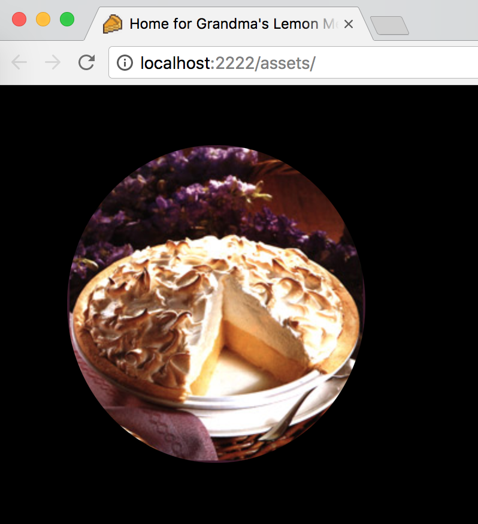
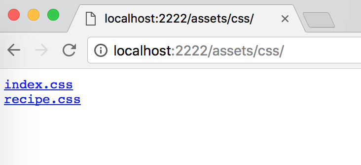
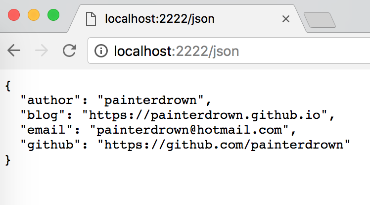
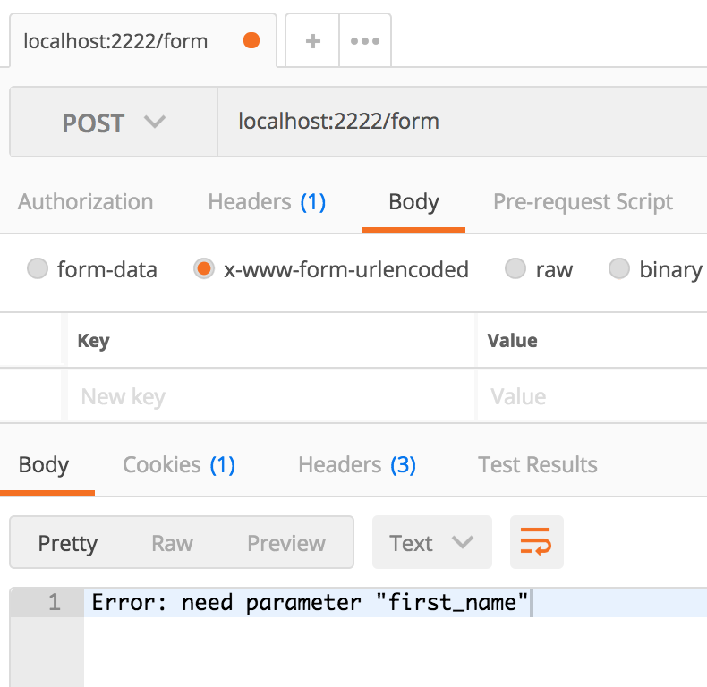
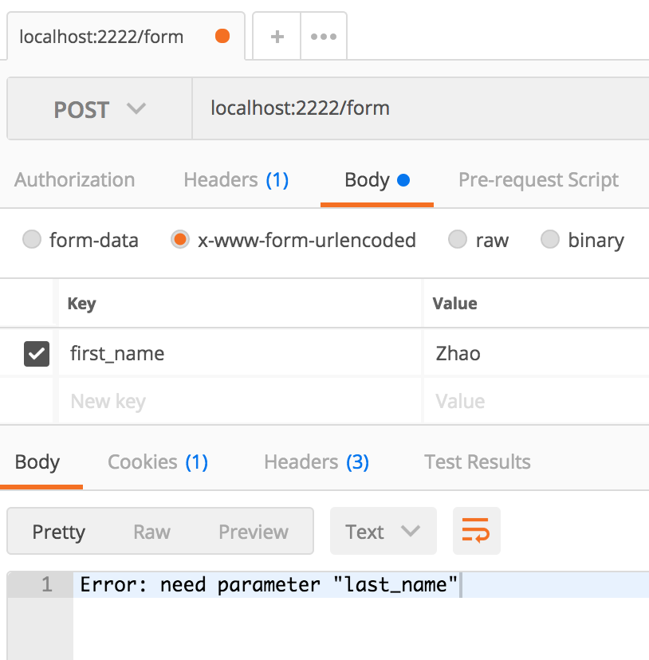
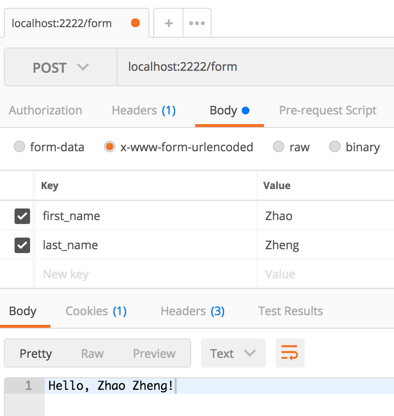
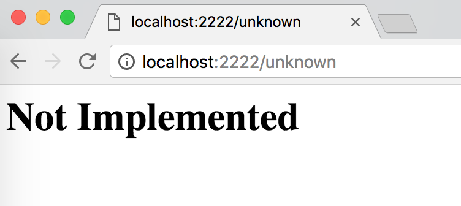

# cloudgo-io

一个基于 Go 的简单 web 服务器，支持的服务如下所示。
  - 静态文件
  - 处理 JSON 请求
  - 处理表单提交
  - 自定义 Not Implemented 页面

## Usage

1. git clone 整个项目 (service-computing) 项目到后，进入 cloudgo-io 目录下。
  - `cd $GOPATH/src`
  - `git clone https://github.com/painterdrown/service-computing.git`
  - `cd service-computing/cloudgo-io`

2. 安装第三方库。
  - `go get github.com/codegangsta/negroni`
  - `go get github.com/gorilla/mux`
  - `go get github.com/unrolled/render`

3. 进入 service 目录后，安装 service 包。
  - `cd service`
  - `go install`

3. 回到上一级目录 (cloudgo-io) 后，运行服务端程序。
  - `cd ..`
  - `go run main.go`

## 功能介绍

### 1. 静态文件

在浏览器访问：http://localhost:2222/assets ，由于我以及添加了 index.html 主页面，所以访问的结果是 index.html 对于的网页内容。

如果要查看静态文件列表，可以访问：http://localhost:2222/assets/css 。

### 2. 处理 JSON 请求

在浏览器访问：http://localhost:2222/json ，可以得到 JSON 文本数据。

### 3. 处理表单提交

上传表单到：http://localhost:2222/form ，这里我是用 Postman 进行表单的提交。需要同时提供：first_name 和 last_name 参数后，才会返回 Hello 文本，否则会提示缺乏相应参数。

### 4. 自定义 Not Implemented 页面

在浏览器访问：http://localhost:2222/unknown ，可以看到自定义的 Not Implemented 页面。

